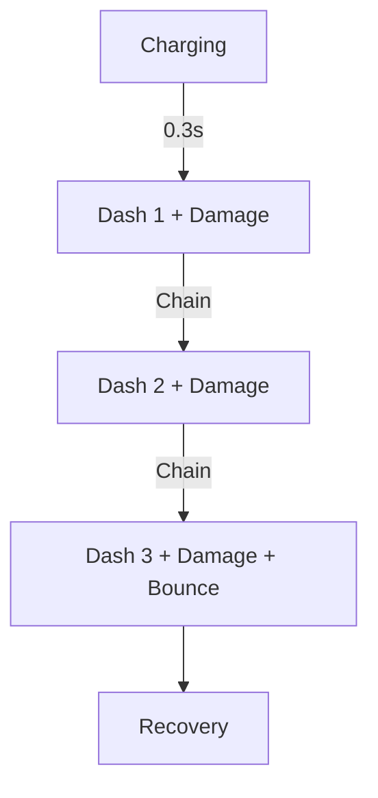
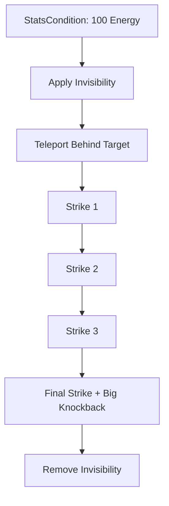

# Architecture du Mod Lighter Daggers

## Concept
Mod Hytale pour les dagues avec un style **rapide/agile + assassin + acrobatique** inspiré de Mars Lighter Sword.

## Gameplay Design

### Primary Attack - "Phantom Pounce"
- Système de charge avec dash multiple
- 3 niveaux de charge = 3 dashs consécutifs
- Chaque dash laisse une traînée spectrale
- Dégâts croissants avec chaque dash
- Bounce sur les ennemis touchés

### Signature - "Shadowstep Assault"
- Invisibilité temporaire
- Téléportation derrière l'ennemi ciblé
- 4 frappes rapides consécutives
- Knockback important sur la dernière frappe
- Effet de "phantom strike" (frappes fantômes)

## Structure du Mod

```
Mods.LighterDaggers/
├── manifest.json
├── Server/
│   ├── Item/
│   │   ├── Items/
│   │   │   └── Weapon/
│   │   │       └── Daggers/
│   │   │           └── Template_Lighter_Daggers.json
│   │   ├── Interactions/
│   │   │   └── Weapons/
│   │   │       └── Daggers/
│   │   │           ├── Primary/
│   │   │           │   └── PhantomPounce/
│   │   │           │       ├── Lighter_Daggers_Primary_Charge.json
│   │   │           │       ├── Lighter_Daggers_Primary_Dash1.json
│   │   │           │       ├── Lighter_Daggers_Primary_Dash2.json
│   │   │           │       ├── Lighter_Daggers_Primary_Dash3.json
│   │   │           │       ├── Lighter_Daggers_Primary_Damage.json
│   │   │           │       └── Lighter_Daggers_Primary_Selector.json
│   │   │           └── Signature/
│   │   │               └── ShadowstepAssault/
│   │   │                   ├── Lighter_Daggers_Signature_Activate.json
│   │   │                   ├── Lighter_Daggers_Signature_Invis.json
│   │   │                   ├── Lighter_Daggers_Signature_Teleport.json
│   │   │                   ├── Lighter_Daggers_Signature_Strike1.json
│   │   │                   ├── Lighter_Daggers_Signature_Strike2.json
│   │   │                   ├── Lighter_Daggers_Signature_Strike3.json
│   │   │                   ├── Lighter_Daggers_Signature_Strike4.json
│   │   │                   └── Lighter_Daggers_Signature_Final.json
│   │   └── RootInteractions/
│   │       └── Weapons/
│   │           └── Daggers/
│   │               ├── Root_Lighter_Daggers_Primary.json
│   │               └── Root_Lighter_Daggers_Signature.json
│   ├── Entity/
│   │   ├── Effects/
│   │   │   └── Weapons/
│   │   │       ├── Lighter_Daggers_Phantom.json
│   │   │       └── Lighter_Daggers_Shadowstep.json
│   │   └── Trails/
│   │       └── Lighter_Daggers_Phantom_Trail.json
│   └── Particles/
│       └── Combat/
│           └── LighterDaggers/
│               ├── Phantom/
│               │   ├── Phantom_Charge.particlespawner
│               │   ├── Phantom_Dash.particlespawner
│               │   └── Phantom_Hit.particlespawner
│               └── Shadowstep/
│                   ├── Shadowstep_Activate.particlespawner
│                   ├── Shadowstep_Strike.particlespawner
│                   └── Shadowstep_Final.particlespawner
```

## Flux d'Interactions

### Primary - Phantom Pounce


### Signature - Shadowstep Assault


## Paramètres Clés

### Dash (ApplyForce)
- Force: 30
- Direction: Z -8 (vers l'avant)
- AirResistance: 0.98
- Style: Linear

### Dégâts
- Dash 1: 15 Physical
- Dash 2: 20 Physical
- Dash 3: 25 Physical + Bounce
- Signature Strikes: 1.5x, 1.5x, 2.0x, 3.0x damage

### Timings
- Primary Cooldown: 0.3s
- Signature Cooldown: 8s
- Invisibility Duration: 3s

## IDs Utilisés (à vérifier dans Asset Editor)
- Animations: PounceStabCharging, RazorstrikeLunge
- Sons: SFX_Daggers_T1_Pounce, SFX_Daggers_T2_Signature_P3
- Particules: Impact_Dagger_Slash, Impact_Critical
- Effets: ShadowStep_Invisible, Dagger_Signature
