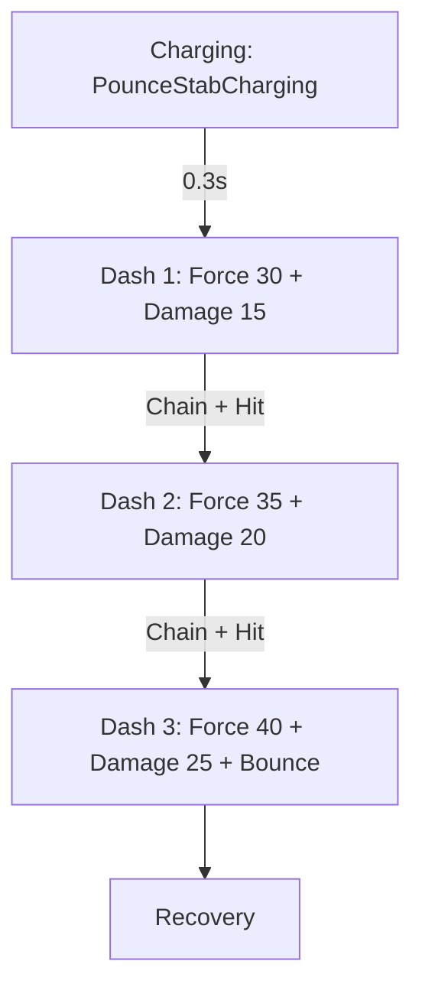
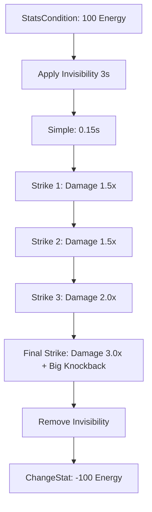

# Architecture Finale - Lighter Daggers

## Analyse de Mars Lighter Sword

### Ce que fait Mars Lighter Sword :
1. **Item Principal** [`Weapon_Lighter_Sword.json`](Mars_Lighter_Sword-1.2.5/Server/Item/Items/Weapon/Sword/Weapon_Lighter_Sword.json:1) :
   - Hérite de [`CustomWeaponType`](Mars_Lighter_Sword-1.2.5/Server/Item/Items/Weapon/Sword/CustomWeaponType.json:1)
   - Utilise [`InteractionVars`](Mars_Lighter_Sword-1.2.5/Server/Item/Items/Weapon/Sword/Weapon_Lighter_Sword.json:42) pour override les dégâts
   - Ajoute des effets de burn sur chaque coup
   - Définit des particules et trails custom

2. **Primary Attack** :
   - [`Charging`](Mars_Lighter_Sword-1.2.5/Server/Item/Interactions/Weapons/Sword/Attacks/Primary/Weapon_Lighter_Sword_Primary.json:2) avec DisplayProgress: false
   - Combo chain avec Swing_Left, Swing_Right, Swing_Down
   - Thrust chargé avec [`ApplyForce`](Mars_Lighter_Sword-1.2.5/Server/Item/Interactions/Weapons/Sword/Attacks/Primary/Thrust/Weapon_Lighter_Sword_Primary_Thrust_Force.json:2) (Force: 40)

3. **Signature** :
   - [`StatsCondition`](Mars_Lighter_Sword-1.2.5/Server/Item/Interactions/Weapons/Sword/Attacks/Signature/VortexStrike/Lighter_Weapon_Signature_VortexMace.json:2) pour vérifier l'énergie
   - Combo: Spin + Groundslam
   - [`ApplyForce`](Mars_Lighter_Sword-1.2.5/Server/Item/Interactions/Weapons/Mace/Signature/Groundslam/Lighter_Sword_Signature_Groundslam_Jump_Force.json:2) avec saut
   - Explosion à l'impact

4. **Effets** :
   - [`ApplyEffect`](Mars_Lighter_Sword-1.2.5/Server/Item/Interactions/Tests/ApplyBurn.json:2) pour appliquer le burn
   - [`Lava_BurnCustom`](Mars_Lighter_Sword-1.2.5/Server/Entity/Effects/Status/Lava_BurnCustom.json:1) effet de statut

---

## Architecture Lighter Daggers

### Concept
Dagues ultra-rapides avec style **assassin/phantom** :
- **Primary**: Pounce avec 3 dashs consécutifs (comme Mars mais en chaîne)
- **Signature**: Shadowstep avec invisibilité + multi-frappes

### Structure

```
Mods.LighterDaggers/
├── manifest.json
├── Server/
│   ├── Item/
│   │   ├── Items/
│   │   │   └── Weapon/
│   │   │       └── Daggers/
│   │   │           └── Weapon_Lighter_Daggers.json
│   │   ├── Interactions/
│   │   │   └── Weapons/
│   │   │       └── Daggers/
│   │   │           ├── Primary/
│   │   │           │   └── PhantomPounce/
│   │   │           │       ├── Lighter_Daggers_Primary_Charge.json
│   │   │           │       ├── Lighter_Daggers_Primary_Dash1.json
│   │   │           │       ├── Lighter_Daggers_Primary_Dash2.json
│   │   │           │       ├── Lighter_Daggers_Primary_Dash3.json
│   │   │           │       ├── Lighter_Daggers_Primary_Damage.json
│   │   │           │       └── Lighter_Daggers_Primary_Selector.json
│   │   │           └── Signature/
│   │   │               └── ShadowstepAssault/
│   │   │                   ├── Lighter_Daggers_Signature_Activate.json
│   │   │                   ├── Lighter_Daggers_Signature_Invis.json
│   │   │                   ├── Lighter_Daggers_Signature_Strike1.json
│   │   │                   ├── Lighter_Daggers_Signature_Strike2.json
│   │   │                   ├── Lighter_Daggers_Signature_Strike3.json
│   │   │                   ├── Lighter_Daggers_Signature_Strike4.json
│   │   │                   └── Lighter_Daggers_Signature_Final.json
│   │   └── RootInteractions/
│   │       └── Weapons/
│   │           └── Daggers/
│   │               ├── Root_Lighter_Daggers_Primary.json
│   │               └── Root_Lighter_Daggers_Signature.json
│   ├── Entity/
│   │   ├── Effects/
│   │   │   └── Weapons/
│   │   │       ├── Lighter_Daggers_Phantom.json
│   │   │       └── Lighter_Daggers_Shadowstep.json
│   │   └── Trails/
│   │       └── Lighter_Daggers_Phantom_Trail.json
│   └── Particles/
│       └── Combat/
│           └── LighterDaggers/
│               ├── Phantom_Charge.particlespawner
│               ├── Phantom_Dash.particlespawner
│               └── Shadowstep_Strike.particlespawner
```

### Flux Primary - Phantom Pounce



### Flux Signature - Shadowstep Assault



### Paramètres Clés

#### Dash (ApplyForce)
```json
{
  "Type": "ApplyForce",
  "Force": 30, // 35, 40 pour dash 2, 3
  "Direction": { "X": 0, "Y": 2, "Z": -8 },
  "ChangeVelocityType": "Add",
  "VelocityConfig": {
    "AirResistance": 0.98,
    "GroundResistance": 0.94,
    "Style": "Linear"
  }
}
```

#### Dégâts (DamageEntityParent)
```json
{
  "Parent": "DamageEntityParent",
  "DamageCalculator": {
    "Class": "Charged",
    "BaseDamage": { "Physical": 15 } // 20, 25 pour dash 2, 3
  },
  "EntityStatsOnHit": [
    { "EntityStatId": "SignatureEnergy", "Amount": 3 }
  ]
}
```

#### Signature - Strike
```json
{
  "Type": "Serial",
  "Interactions": [
    {
      "Type": "ApplyEffect",
      "EffectId": "Lighter_Daggers_Shadowstep"
    },
    {
      "Type": "Simple",
      "RunTime": 0.15,
      "Effects": {
        "ItemAnimationId": "RazorstrikeLunge"
      },
      "Next": {
        "Type": "Replace",
        "Var": "Shadowstep_Strike",
        "DefaultValue": {
          "Interactions": ["Lighter_Daggers_Signature_Strike1"]
        }
      }
    }
  ]
}
```

### Effets d'Entité

#### Lighter_Daggers_Phantom
```json
{
  "ApplicationEffects": {
    "EntityBottomTint": "#1a0033",
    "EntityTopTint": "#6600cc",
    "Particles": [{ "SystemId": "Phantom_Aura" }]
  },
  "Duration": 2,
  "OverlapBehavior": "Overwrite"
}
```

#### Lighter_Daggers_Shadowstep
```json
{
  "ApplicationEffects": {
    "EntityBottomTint": "#000000",
    "EntityTopTint": "#1a1a1a",
    "ScreenEffect": "ScreenEffects/Invisible.png"
  },
  "Duration": 3,
  "OverlapBehavior": "Overwrite"
}
```

### Item Template

```json
{
  "Parent": "Template_Weapon_Daggers",
  "TranslationProperties": {
    "Name": "server.items.Weapon_Lighter_Daggers.name"
  },
  "Quality": "Legendary",
  "ItemLevel": 40,
  "InteractionVars": {
    "Pounce_Dash1_Damage": {
      "Interactions": [
        {
          "Parent": "Weapon_Daggers_Primary_Pounce_Stab_Damage",
          "DamageCalculator": { "BaseDamage": { "Physical": 15 } },
          "EntityStatsOnHit": [{ "EntityStatId": "SignatureEnergy", "Amount": 3 }]
        },
        "ApplyPhantom"
      ]
    },
    "Pounce_Dash2_Damage": { ... },
    "Pounce_Dash3_Damage": { ... },
    "Shadowstep_Strike1": { ... },
    "Shadowstep_Strike2": { ... },
    "Shadowstep_Strike3": { ... },
    "Shadowstep_Strike4": { ... }
  },
  "Particles": [
    {
      "SystemId": "Phantom_Aura",
      "TargetNodeName": "Handle",
      "TargetEntityPart": "PrimaryItem"
    }
  ],
  "Trails": [
    {
      "TrailId": "Lighter_Daggers_Phantom_Trail",
      "TargetNodeName": "Handle",
      "TargetEntityPart": "PrimaryItem"
    }
  ]
}
```

### IDs Référencés (du jeu de base)
- Animations: PounceStabCharging, RazorstrikeLunge, Pounce
- Sons: SFX_Daggers_T1_Pounce, SFX_Daggers_T2_Signature_P3
- Particules: Impact_Dagger_Slash, Impact_Critical, Dagger_Charging
- Effets: ShadowStep_Invisible, Dagger_Signature

### Cooldowns
- Primary: 0.25s
- Signature: 8s
- Invisibility Duration: 3s
